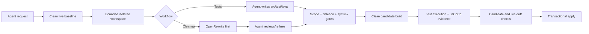

<div align="center">
  
  <h1>JAIPilot MCP</h1>
  <p><strong>Verified Java unit-test generation and OpenRewrite-first code cleanup for coding agents.</strong></p>
  <p>
    <a href="https://github.com/JAIPilot/jaipilot-cli/actions/workflows/ci.yml">
      
    </a>
    <a href="https://github.com/JAIPilot/jaipilot-cli/releases">
      
    </a>
    <a href="LICENSE">
      
    </a>
  </p>
</div>

JAIPilot is a local stdio [Model Context Protocol](https://modelcontextprotocol.io/) server plus portable [Agent Skills](https://agentskills.io/specification). It gives MCP-capable coding agents a rigorous Java change pipeline without binding the project to Codex, Claude, Copilot, Cursor, or any model provider.

There is no interactive JAIPilot CLI and no JAIPilot backend. Your coding agent reads and edits code; JAIPilot discovers targets, establishes a clean baseline, creates an isolated workspace, runs OpenRewrite, verifies the candidate, proves changed tests executed, measures JaCoCo coverage, detects drift, and applies accepted files transactionally.

## Why JAIPilot

- Works with coding tools that can launch a local stdio MCP server; the bundled skills add the higher-level workflow on hosts that support Agent Skills or plugins.
- Generates focused Java tests for named, changed, all, or freshly measured under-covered classes.
- Cleans selected Java code with pinned OpenRewrite `CodeCleanup` and `CommonStaticAnalysis` recipes before agent review.
- Uses a clean baseline and a separate clean candidate build rather than trusting an agent's claim that code works.
- Requires non-zero Surefire, Failsafe, or Gradle XML execution evidence for changed tests.
- Uses fresh JaCoCo XML as the coverage source of truth and can make a requested line-coverage target an apply gate.
- Rejects deletions, path traversal, symbolic-path substitution, out-of-scope edits, build-time source drift, stale candidates, and live-worktree drift.
- Applies only the exact immediately validated snapshot, with staged writes and rollback.
- Keeps work bounded: four active runs globally, one per project, two-hour expiry, bounded MCP file payloads, bounded process output, and cancellation-aware timeouts.
- Keeps JSON-RPC reliable: stdout is protocol-only; installer receipts and diagnostics go to stderr.
- Runs locally with the repository's Maven or Gradle wrapper and normal dependency caches. No provider API key or repository upload to a JAIPilot service is required.

## Install

Install the published, checksum-protected release payload:

```bash
curl -fsSL https://raw.githubusercontent.com/JAIPilot/jaipilot-cli/main/install.sh | sh
```

The `jaipilot` npm package is fully prepared but its first publication still requires the package owner to claim the name and register this repository's release workflow as an npm trusted publisher. After that one-time registry setup, this equivalent route is available:

```bash
npm install --global jaipilot
```

The npm package has no runtime dependencies or install lifecycle script. Its first launch downloads the matching GitHub release, verifies its SHA-256 checksum, and caches the bundled Java runtime. Both routes install `jaipilot-mcp`; direct installation also prints the exact path of the bundled `plugin/jaipilot` directory. Supported release platforms are macOS and Linux on x64 and arm64/aarch64. Building from source requires Java 17+; the published bundles include Java.

Target repositories need a usable Maven or Gradle build. Coverage-based selection and coverage gates require JaCoCo XML reporting. The first cleanup may need access to Maven Central or the Gradle Plugin Portal for the pinned OpenRewrite artifacts.

## Connect a coding agent

### Codex

```bash
codex mcp add jaipilot -- jaipilot-mcp
```

Equivalent Codex configuration:

```toml
[mcp_servers.jaipilot]
command = "jaipilot-mcp"
```

For the complete workflow, install or point Codex at `plugin/jaipilot`, which bundles the MCP declaration and both skills.

### Claude Code

```bash
claude mcp add --scope user jaipilot -- jaipilot-mcp
```

The bundled plugin also has a Claude manifest and can be loaded from `plugin/jaipilot` by plugin-aware installations.

### Cursor and generic MCP clients

Use the client's MCP settings or a project-level `.mcp.json`/`.cursor/mcp.json` when supported:

```json
{
  "mcpServers": {
    "jaipilot": {
      "command": "jaipilot-mcp",
      "args": []
    }
  }
}
```

### GitHub Copilot coding agent

The bundled directory follows the plugin layout documented for Copilot CLI and the Copilot SDK: root `plugin.json`, `.mcp.json`, and `skills/`. Load the installed `plugin/jaipilot` directory with the host's plugin-directory option. Hosts that discover project skills directly can use the two directories under `plugin/jaipilot/skills/`.

MCP tool support is the portable foundation; automatic skill/plugin discovery varies by host. A client must support local stdio MCP servers to use JAIPilot's tools.

## Use it naturally

After connecting JAIPilot, ask the coding agent rather than learning a command language:

```text
Generate strong unit tests for OrderService and reach at least 90% line coverage.
Generate tests for changed production classes in this project.
Clean the changed Java classes with JAIPilot and OpenRewrite, then apply the verified result.
Review all Java production classes, but show me the validated cleanup before applying it.
```

The bundled `jaipilot-generate-tests` and `jaipilot-clean-java` skills lead the agent through prepare → inspect/edit → validate/fix → apply or discard. If a host cannot access the returned temporary workspace directly, the bounded `read_run_file` and `write_run_file` tools provide the same workflow entirely through MCP.

## MCP tools

| Tool | Purpose | Live source changes |
| --- | --- | --- |
| `jaipilot_inspect_project` | Detect build, wrappers, Java targets, changed classes, cached coverage, and active runs | None |
| `jaipilot_prepare_tests` | Clean-baseline a project and create an isolated test-generation run | None |
| `jaipilot_prepare_cleanup` | Clean-baseline, isolate, and run exactly scoped OpenRewrite recipes | None |
| `jaipilot_get_run` | Read active-run state and its last validation | None |
| `jaipilot_read_run_file` | Read a bounded UTF-8 file from the isolated workspace | None |
| `jaipilot_write_run_file` | Write an allowlisted Java file in the isolated workspace | None |
| `jaipilot_validate_run` | Check scope, clean build, test execution, coverage, and build drift | None |
| `jaipilot_apply_run` | Transactionally merge an immediately validated, unchanged candidate | Selected files only |
| `jaipilot_discard_run` | Delete an abandoned isolated workspace | None |

Apply is intentionally the only path that changes live source. Preparing, editing, and validating are reversible.

## Verification architecture



### Unit-test generation

`classes`, `changed`, `all`, and `coverage` target modes are deterministic. Coverage mode first invalidates recognized reports and runs the clean full suite, then selects from that exact snapshot. The agent writes only `src/test/java/**/*.java`. Validation independently runs the clean project gate, checks every changed test against newly created execution reports, and reports before/after line and branch coverage where JaCoCo is configured.

### Java cleanup

Cleanup runs pinned OpenRewrite recipes in the sandbox with an exact selected-source precondition and temporary configuration. It does not persist a rewrite plugin or recipe declaration in the target repository. The agent then reviews, retains, refines, or reverts the deterministic candidate and may add directly relevant regression tests. Validation permits only selected production Java files and Java tests.

OpenRewrite contributes repeatable mechanical and static-analysis transformations; the coding agent contributes repository context and judgment; JAIPilot owns acceptance and merge safety.

## Comparison: choose the right layer

JAIPilot aims to outperform finding-only workflows at the local **change → proof → safe apply** journey. It is not honest to claim that any one tool is universally “supremely better” than every other tool. Superiority must be scoped to comparable outcomes and backed by reproducible evidence.

| Capability | JAIPilot MCP | SonarQube | OpenRewrite alone | Direct coding agent |
| --- | --- | --- | --- | --- |
| Primary job | Agent-driven Java tests and verified remediation | Continuous static/security analysis and governance | Deterministic source transformations | General repository reasoning and edits |
| Creates project-specific tests | Yes, through the connected agent | No end-to-end generation workflow | No | Yes |
| Deterministic cleanup recipes | OpenRewrite first, then contextual review | Rule-dependent fixes | Core strength | Model-dependent |
| Clean behavioral proof before apply | Required | Quality gates analyze configured measures; they do not own the source transaction | Build integration is user-defined | Host/prompt-dependent |
| Changed-test execution proof | Required | Imports test/coverage measures | No built-in agent workflow | Host/prompt-dependent |
| Fresh coverage-driven target selection | Yes | Central coverage gates and dashboards | No | Must be assembled |
| Isolated candidate and strict write scope | Built in | Does not own local edits | Recipe execution scope | Host-dependent |
| Concurrent-work drift + transactional merge | Built in | Not its role | Not its role | Host-dependent |
| Security taint analysis and hotspot review | Not a substitute | Stronger | Recipe-dependent | Not formal analysis |
| Organization-wide policy, history, portfolios | Not a substitute | Stronger | No | No |
| Language breadth | Java-focused | Broad | Broad recipe ecosystem | Model-dependent |
| Local/private operation | Local server; no JAIPilot backend | Self-hosted or cloud | Local | Depends on host/provider |

SonarQube remains complementary and is retained in this repository's CI for deterministic analysis and governance. JAIPilot's defensible advantage is a narrower but complete remediation transaction: it can turn agent reasoning and OpenRewrite output into an allowlisted candidate, prove that candidate with the actual build and execution evidence, and avoid overwriting concurrent work. Compare tools on accepted fixes, false positives, escaped defects, regressions, test quality, elapsed time, reviewer actions, and recovery—not slogans.

## Performance and reliability policy

JAIPilot optimizes the complete local journey, not a synthetic method benchmark. Hot paths are designed around one baseline build, one isolated candidate, one final verification, bounded filesystem copies that exclude VCS/build/cache directories, bounded subprocess output, exact target selection, and no nested model invocation. External build and agent time is reported separately where possible.

Performance-sensitive changes must use repeatable before/after measurements on the same machine, JDK, fixture, cache state, command, and boundaries. Stable paths use at least five runs and report median and p95. JAIPilot never buys speed by accepting stale JaCoCo data, skipping test execution proof, weakening scope, or increasing a timeout to conceal a defect.

## Development

```bash
./mvnw -B verify
npm ci --ignore-scripts
npm test
./scripts/smoke-test-install.sh
./scripts/smoke-test-npm.sh
```

`verify` runs the Java unit/integration suite, creates JaCoCo XML, builds the shaded MCP server, and creates the current-platform bundled-runtime archive. The smoke tests exercise a real MCP initialize/tools-list exchange, checksum-verified installation, first npm launch, and cached npm launch.

The implementation uses the official [Java MCP SDK](https://github.com/modelcontextprotocol/java-sdk). OpenRewrite behavior follows its [official recipes and plugin guidance](https://docs.openrewrite.org/). SonarQube quality gates remain available through `./mvnw -B verify sonar:sonar` and the repository workflow.

## Release and CLI archive

Release tags build checksum-protected macOS/Linux archives for x64 and arm64, publish them to GitHub Releases, and publish the dependency-free `jaipilot` npm launcher through trusted publishing when the package owner has configured it.

The final pre-MCP CLI is preserved exactly on branch [`archive/cli-v1.0.16`](https://github.com/JAIPilot/jaipilot-cli/tree/archive/cli-v1.0.16) and tag [`v1.0.16`](https://github.com/JAIPilot/jaipilot-cli/releases/tag/v1.0.16). `main` is MCP- and skills-native from version 2.0.0 onward.

## License

[MIT](LICENSE)
