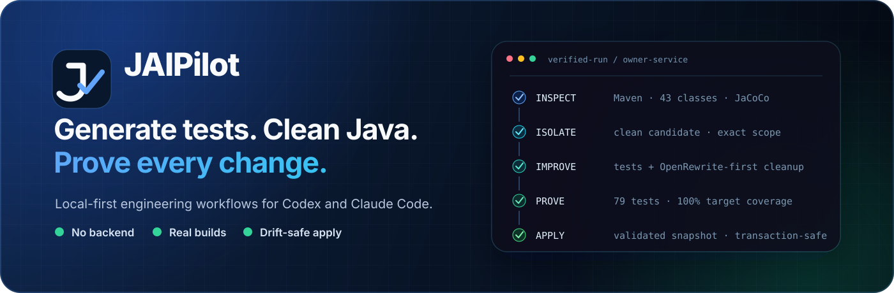

<p align="center">
  
</p>

<p align="center">
  <a href="https://github.com/JAIPilot/jaipilot/actions/workflows/ci.yml"></a>
  <a href="https://github.com/JAIPilot/jaipilot/releases"></a>
  <a href="LICENSE"></a>
  
  
</p>

<p align="center">
  <strong>Proof-driven Java engineering for Codex and Claude Code.</strong><br />
  JAIPilot turns agent-written tests and refactors into isolated, build-verified, coverage-measured,
  drift-safe changes before they reach your working tree.
</p>

<p align="center">
  <a href="#install">Install</a> ·
  <a href="#what-jaipilot-does">Capabilities</a> ·
  <a href="docs/how-it-works.md">How it works</a> ·
  <a href="docs/evaluations/spring-framework-petclinic.md">Petclinic evaluation</a> ·
  <a href="https://github.com/JAIPilot/jaipilot/releases/latest">Latest release</a>
</p>

## Java changes should arrive with proof

Coding agents are good at proposing code. Production Java work needs more: exact scope, the real
build, executed tests, fresh coverage, concurrent-work protection, and a safe way to land the
result. JAIPilot makes those constraints part of the workflow instead of relying on prompt text.

```text
INSPECT  →  ISOLATE  →  IMPROVE  →  PROVE  →  APPLY
 project     clean       agent +     build,     validated
 context     candidate   recipes     tests,     snapshot
                                      coverage
```

The connected agent reasons about your code and edits only the isolated candidate. JAIPilot owns
the deterministic controls around it. There is no JAIPilot backend, source upload, provider API
key, nested model invocation, or npm dependency.

## What JAIPilot does

| Workflow | What the agent does | What JAIPilot proves |
| --- | --- | --- |
| **Generate tests** | Writes focused JUnit tests for named, changed, all, or freshly under-covered classes | Changed tests executed; clean build passed; target coverage is fresh; requested coverage gates are met |
| **Clean Java** | Reviews and refines an exactly scoped OpenRewrite candidate | Production scope stayed allowlisted; related tests executed; behavior passed the real build; candidate and live source did not drift |
| **Apply safely** | Reviews the evidence and decides whether to land the result | Only the immediately validated snapshot is merged, transactionally, with rollback on failure |

JAIPilot supports Maven and Gradle projects, prefers valid project wrappers, and uses JaCoCo when
the project already configures it. Cleanup starts with pinned `CodeCleanup` and
`CommonStaticAnalysis` recipes; it never leaves an OpenRewrite plugin or recipe declaration in the
target project.

## Install

### Codex

```bash
codex plugin marketplace add JAIPilot/jaipilot --ref main
codex plugin add jaipilot@jaipilot
```

Start a new Codex thread after installation.

### Claude Code

```bash
claude plugin marketplace add JAIPilot/jaipilot
claude plugin install jaipilot@jaipilot
```

Run `/reload-plugins` after installation.

The plugin contributes two Agent Skills:

- `jaipilot-generate-tests` — coverage-aware, execution-proven Java test generation.
- `jaipilot-clean-java` — OpenRewrite-first cleanup with build proof and guarded apply.

On first use, the pinned plugin launcher downloads the matching GitHub release, verifies its
published SHA-256 checksum, and caches a private bundled runtime. Managed or offline environments
can set `JAIPILOT_TOOLKIT_EXECUTABLE` to an approved runner instead.

## Ask naturally

```text
Generate strong unit tests for OrderService and reach at least 90% line coverage.
Add tests for the production classes changed on this branch.
Clean the changed Java classes and apply only a fully verified candidate.
Review PaymentService for safe cleanup, but show me the evidence before apply.
```

The skill chooses the deterministic target mode, prepares a clean candidate, guides the agent
inside that workspace, validates the result, and applies or discards it.

## Proof on Spring Framework Petclinic

We exercised the released v3 workflow against a clean Spring Framework Petclinic revision on
macOS x64 with its real Maven wrapper and JaCoCo configuration.

| Check | Observed result |
| --- | --- |
| Untouched baseline | 75 tests passed; 85.69% aggregate line coverage |
| `Owner` test generation | 55% → 95% line coverage; 30% → 100% branch coverage |
| Coverage gate | Apply correctly blocked at 72.5% when the requested target was 80% |
| `CallMonitoringAspect` cleanup | OpenRewrite touched one selected class; four related tests raised target line and branch coverage from 0% to 100% |
| Final cleanup suite | 79 tests passed with zero failures |
| Drift safety | A post-validation edit was rejected in 0.48s and identified the exact file |

This is a reproducible product evaluation, not a universal benchmark. See the
[revision, boundaries, commands, timings, and known reporting gaps](docs/evaluations/spring-framework-petclinic.md).

## Safety model

- Clean live baseline before candidate creation.
- Isolated workspaces with strict Java-path allowlists.
- Deletion, path traversal, and symbolic-path rejection.
- Fresh Surefire, Failsafe, or Gradle XML execution evidence for changed tests.
- Fresh JaCoCo coverage for coverage-driven targeting and test-generation gates.
- Build-generated source drift, candidate drift, and live-worktree drift detection.
- One active run per project, four globally, with locks, owner-only state, expiry, and recovery.
- Explicit confirmation plus transactional writes for apply.

Read the complete [verification and transaction model](docs/how-it-works.md).

## JAIPilot and static analysis

JAIPilot owns the local **change → proof → safe apply** journey. It does not replace formal taint
analysis, centralized governance, compliance dashboards, portfolios, or historical quality gates.
Use SonarQube or equivalent analysis alongside JAIPilot when those capabilities matter. See the
[product boundary and comparison criteria](docs/static-analysis-boundary.md).

## Build from source

Requirements: Java 17+, Git, Python 3, and a POSIX shell.

```bash
./mvnw -B verify
python3 ./scripts/validate-plugin.py
./scripts/smoke-test-install.sh
```

`verify` runs the Java suite, generates JaCoCo XML, builds the shaded internal runner, and packages
the current-platform distribution. Release tags publish checksum-protected macOS and Linux
archives for x64 and arm64/aarch64.

## Project resources

- [How JAIPilot works](docs/how-it-works.md)
- [Spring Framework Petclinic evaluation](docs/evaluations/spring-framework-petclinic.md)
- [Static-analysis boundary](docs/static-analysis-boundary.md)
- [Contributing](CONTRIBUTING.md)
- [Support](SUPPORT.md)
- [Security policy](SECURITY.md)
- [Changelog](CHANGELOG.md)

## License

JAIPilot is available under the [MIT License](LICENSE).
