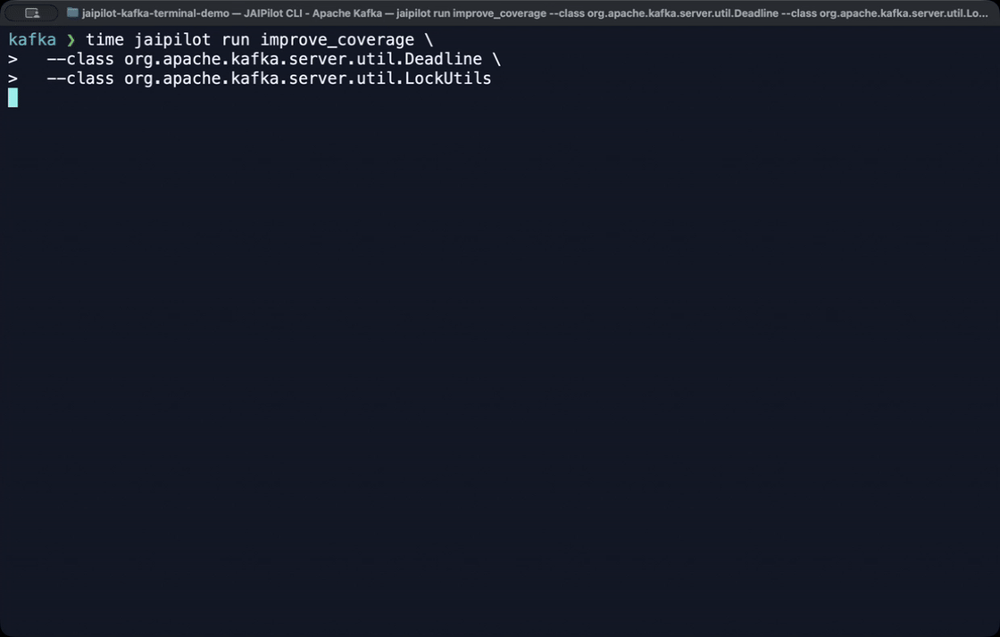

<p align="center">
  
</p>

<h1 align="center">JAIPilot — faster Java testing, stronger coverage, fewer bugs</h1>

<p align="center">
  <strong>Make your tests bulletproof.<br>
  ~5× faster testing.<br>
  Enterprise grade unit tests. A 90%+ line coverage target.</strong>
</p>

**Your Java testing specialist—straight from the terminal.** Generate, repair, and verify tests. Fewer prompts. Stronger assertions.

**Optimized for outcomes. Choose an outcome. Select your code. Get verified tests.** Start with the CLI. Add MCP when you want JAIPilot inside your coding agent.

<p align="center">
  <a href="https://github.com/JAIPilot/jaipilot/releases/latest">Download CLI</a> ·
  <a href="#install">Get started</a> ·
  <a href="#mcp-for-coding-agents">MCP setup</a> ·
  <a href="https://www.jaipilot.com/">JAIPilot.com</a>
</p>

## See it run

### Apache Kafka

<p align="center">
  
</p>

**34.3% → 97.1% line coverage for two classes in 1m 53s.** Added **13 tests**; all **949 module tests passed**.

### Spring Petclinic — 100% coverage

<p align="center">
  
</p>

**85.7% → 100% line coverage across the project in 3m 21s.** Added **36 tests** with `coverage_100`; all **111 tests passed**.

Production code preserved. Actual Terminal recordings; GIFs shorten idle waits. Reported times are full job durations with warm build caches; results vary. [Commands, recordings, and full measurements →](docs/examples.md)

## How it works

**Frontier LLM reasoning. Optimized testing tools. Prompts tailored to each outcome. Parallel workers in the managed service.** Independent class tasks can run concurrently; local execution uses your toolchain and supported hardware parallelism.

1. **Inspect** your code, build, and test framework.
2. **Generate or repair** tests for behavior, boundaries, and failure paths, with meaningful assertions.
3. **Verify** with focused tests, the final regression suite, and fresh coverage reports when configured.

**90%+ line coverage target** for `generate_tests`, `improve_coverage`, and `lock_behavior`, measured in selected production code when coverage is configured. Gaps and blockers are reported. Behavior baselines must pass before edits.

| Outcome | Workflow |
| --- | --- |
| Generate unit tests | `generate_tests` |
| Improve coverage | `improve_coverage` |
| Fix failing tests | `fix_tests` |
| Stabilize flaky tests | `stabilize_flaky_tests` |
| Test current changes | `test_current_changes` |
| Lock behavior before a refactor | `lock_behavior` |
| Target 100% line coverage | `coverage_100` |

## Install

Requires Git, a JDK, and your project's build tools.

**macOS / Linux**

```bash
curl -fsSL https://raw.githubusercontent.com/JAIPilot/jaipilot/main/install.sh | sh
```

**Windows (PowerShell)**

```powershell
irm https://github.com/JAIPilot/jaipilot/releases/latest/download/install.ps1 | iex
```

**npm**

```bash
npm install -g jaipilot
```

**Homebrew (macOS / Linux)**

```bash
brew install JAIPilot/tap/jaipilot
```

Sign in, then run inside your Java repository:

```bash
jaipilot auth login
jaipilot run improve_coverage --class com.acme.OrderService
```

Same JAIPilot account, subscription, and credits. Automatic update checks before workflows.

[Install paths, manual updates, and troubleshooting →](docs/cli-guide.md)

## Use the CLI

```bash
jaipilot run generate_tests --class com.acme.OrderService
jaipilot run test_current_changes --all
jaipilot run lock_behavior --path src/main/java/com/acme
```

Scope: whole repository, classes, paths, or selected lines. Review the result and `git diff` before accepting changes.

For a fresh, verified coverage target on a single-module Maven project:

```bash
jaipilot run improve_coverage --all --coverage-target 80
```

Build tool adapters also provide local coverage checks and generation:

```bash
./mvnw com.jaipilot:jaipilot-maven-plugin:1.2.1:check -Djaipilot.coverage.line=80
./mvnw com.jaipilot:jaipilot-maven-plugin:1.2.1:run -Djaipilot.coverage.line=80
./gradlew jaipilotCheck -Pjaipilot.coverage.line=80
./gradlew jaipilotRun -Pjaipilot.coverage.line=80
```

The Maven adapter 1.2.1 is published on Maven Central. The Gradle plugin is submitted
and awaiting Portal approval; install it from source until approved. Use `mvnw.cmd` /
`gradlew.bat` in Windows PowerShell. [Adapter setup, class/branch targets, and supported JaCoCo rules →](docs/build-tools.md)

[All commands, scopes, JSON output, and exit codes →](docs/cli-guide.md#run-an-outcome)

## Why use JAIPilot if my coding agent already writes tests?

**Fast testing. High coverage. Stronger tests. Less work for your coding agent.**

- **~5× faster testing than a general coding agent.** Optimized prompts, tools, and parallel workers carry the testing workflow. Actual runtime varies by project. CLI examples: **97.1% coverage in 1m 53s** on Kafka; **100% in 3m 21s** on Petclinic.
- **90%+ line coverage target.** Meaningful assertions for selected behavior, boundaries, and failure paths, measured with your configured coverage tools.
- **Stronger regression protection.** Lock behavior before edits; verify the original tests afterward. Our paired Codex example's saved tests caught **7/10 injected faults vs 3/10** with Codex alone.
- **Token efficiency.** Offload test planning, generation, and repairs to JAIPilot's optimized service. This can reduce your coding agent's testing context, token use, and costs; JAIPilot credits apply.

### Measured example: Codex with JAIPilot

Same refactor. Two fresh Codex sessions. Two Kafka utility classes. The MCP session used JAIPilot automatically, with **no repository instruction file or extra testing prompt**.

| Saved regression suite | Codex alone | Codex + JAIPilot |
| --- | --- | --- |
| Passing JUnit tests | 3 | **16** |
| Line coverage of the selected `Deadline` class | 47.1% | **100%** |
| Line coverage across both fixture classes | 40% | **65.7%** |
| Branch coverage across both fixture classes | 30% | **80%** |
| Injected faults caught by the saved tests | 3/10 | **7/10** |

**13 more reusable tests. Four more deliberately introduced bugs caught.** Same model, settings, initial tests, and warm build caches. One paired example; results vary.

**The 90% target applies to selected code.** `Deadline`: **100% (17/17 lines)**. The combined **65.7% (23/35)** includes untargeted `LockUtils`, unchanged at 6/18 covered lines.

[Method, evidence, and reproduction →](docs/benchmarks/codex-mcp-2026-10-05/README.md)

## MCP for coding agents

**Optional: make Codex, Claude Code, or another MCP agent better at Java testing.** Give it a tested baseline before edits and real failures to guide repairs.

1. **Lock:** `lock_behavior` creates and runs characterization tests before production edits, targeting 90%+ line coverage when configured.
2. **Edit:** Your coding agent changes production code. Baseline tests stay unchanged.
3. **Verify:** `verify_behavior` reruns the original baseline. Your agent investigates failures and repairs unintended changes before finishing.

Passing tests protect the behavior they exercise. Review old expectations for intentional behavior changes.

**Codex**

```bash
codex mcp add jaipilot -- jaipilot mcp --repo /absolute/path/to/java-repository
```

**Claude Code**

```bash
claude mcp add --transport stdio jaipilot -- jaipilot mcp --repo /absolute/path/to/java-repository
```

Start a new agent session. **MCP instructions and tool descriptions include the workflow. No repository instruction file required.** Tests and commands run locally. Jobs run in the background; **1 hour per local command by default**.

Requires a build with the `mcp` command. [Source setup, tool contracts, and timeout options →](docs/coding-agents.md)

## Local execution and privacy

Builds and tests run locally. Selected source, project context, and command output go to JAIPilot's managed service and model provider. Sign-in credentials stay local with user-only permissions.

[Privacy details](docs/cli-guide.md#local-execution-and-privacy) · [Ask a question](https://github.com/JAIPilot/jaipilot/discussions) · [Report an issue](https://github.com/JAIPilot/jaipilot/issues) · [Report a vulnerability privately](https://github.com/JAIPilot/jaipilot/security/advisories/new)

[MIT License](LICENSE) · [JAIPilot.com](https://www.jaipilot.com/)
