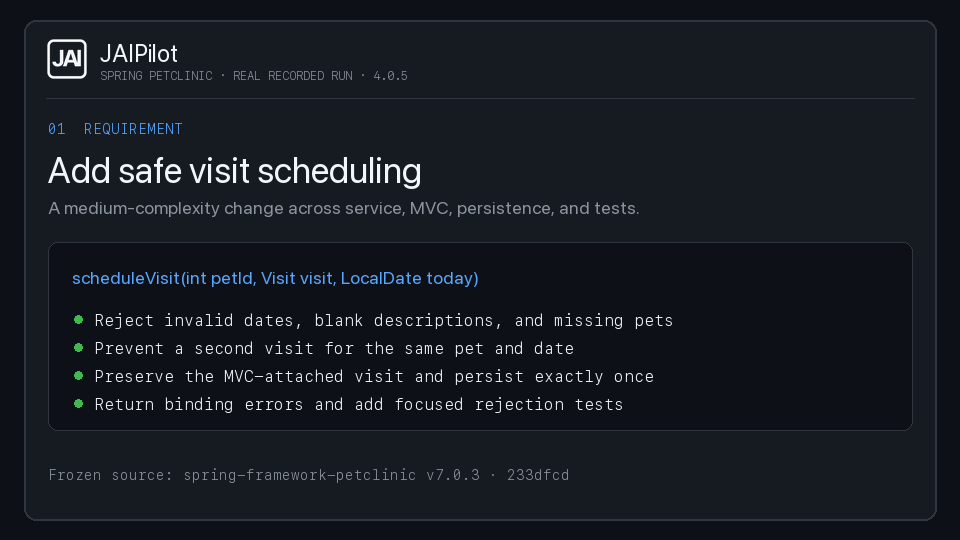

# Spring Petclinic visit-scheduling demonstration

This is a recorded JAIPilot 4.0.5 demonstration, not an A/B benchmark. Codex implemented one
medium-complexity use case in a fresh Spring Framework Petclinic clone. JAIPilot supplied scoped
quality feedback and exact-diff proof. Hidden tests added only after the agent stopped decided
whether the final patch was accepted.

## Frozen setup

- Repository: `spring-petclinic/spring-framework-petclinic`
- Revision: `233dfcd06db3fb0505c2accc106f45ef72670990` (`v7.0.3`)
- Java: Amazon Corretto 17.0.13
- Agent: Codex CLI 0.147.0, `gpt-5.6-sol`, `xhigh`, fast service tier
- JAIPilot: 4.0.5, invoked through its installed Codex plugin MCP server
- Task: [visit scheduling](../../petclinic-pilot/tasks/visit-scheduling.md)
- Independent oracle: [five hidden contract tests](../../petclinic-pilot/hidden/visit-scheduling/org/springframework/samples/petclinic/service/acceptance/VisitSchedulingAcceptanceTests.java)

The run used a new clone, private JAIPilot state, warm Maven dependencies, a 20-minute agent limit,
and the same independent acceptance runner used by the controlled pilot. The prompt told the agent
to use available tools only when they materially helped. It did not prescribe a sequence of
JAIPilot calls.

## What happened

1. JAIPilot inspected the Maven repository and found 43 production classes with JaCoCo configured.
2. Codex implemented scheduling across the service API, service implementation, MVC controller,
   and focused tests. Thirteen focused tests passed.
3. JAIPilot changed-scope quality reported score 98.4 and two medium complexity findings on the new
   service method: cyclomatic complexity 13 and cognitive complexity 16.
4. Codex extracted input-validation, pet-lookup, and conflict-detection helpers. The same focused
   tests passed, and JAIPilot quality then reported score 100.0 with zero findings.
5. JAIPilot proved the exact five-file fingerprint with a clean isolated build, fresh execution for
   two changed test classes, coverage, PIT, quality, and ArchUnit.
6. After the agent stopped, the independent runner added the hidden tests. All five hidden tests and
   all 89 tests in `clean verify` passed. Diff and allowed-scope checks also passed.

## Recorded result

| Measure | Result |
| --- | ---: |
| Independent acceptance | Passed |
| Hidden contract tests | 5/5 |
| Clean verification | 89/89 tests |
| Executable changed-line coverage | 100% |
| Changed-branch coverage | 95.5% |
| Mutation score | 95.0% (19/20 killed) |
| Changed quality | 100.0, zero findings |
| Architecture violations | 0 |
| JAIPilot proof time | 41.259 s |
| Agent time | 788.894 s |

The one surviving mutation remains visible in [evidence.json](evidence.json). The configured 80%
mutation gate passed; JAIPilot did not describe the result as mutation-perfect.

## Artifacts

- [Structured measurements](evidence.json)
- [Independent runner result](result.json)
- [Exact agent patch (gzip)](agent.patch.gz) — decompresses byte-for-byte to the recorded patch;
  both compressed and uncompressed SHA-256 values are in [evidence.json](evidence.json).
- [Task prompt](../../petclinic-pilot/tasks/visit-scheduling.md)
- [Hidden acceptance test](../../petclinic-pilot/hidden/visit-scheduling/org/springframework/samples/petclinic/service/acceptance/VisitSchedulingAcceptanceTests.java)

## What this does not prove

This single successful run does not establish that JAIPilot improves acceptance rates, latency,
tokens, or every Java change. JAIPilot's proof established what the agent's selected tests and
deterministic gates exercised; the hidden tests independently established this task's business
contract afterward. The earlier randomized [24-trial controlled pilot](../../petclinic-pilot/RESULTS.md)
found equal acceptance and substantial overhead for the broader JAIPilot 4.0.3 workflow. Keep those
results separate: the pilot is the comparison, while this run is a current-product demonstration.
